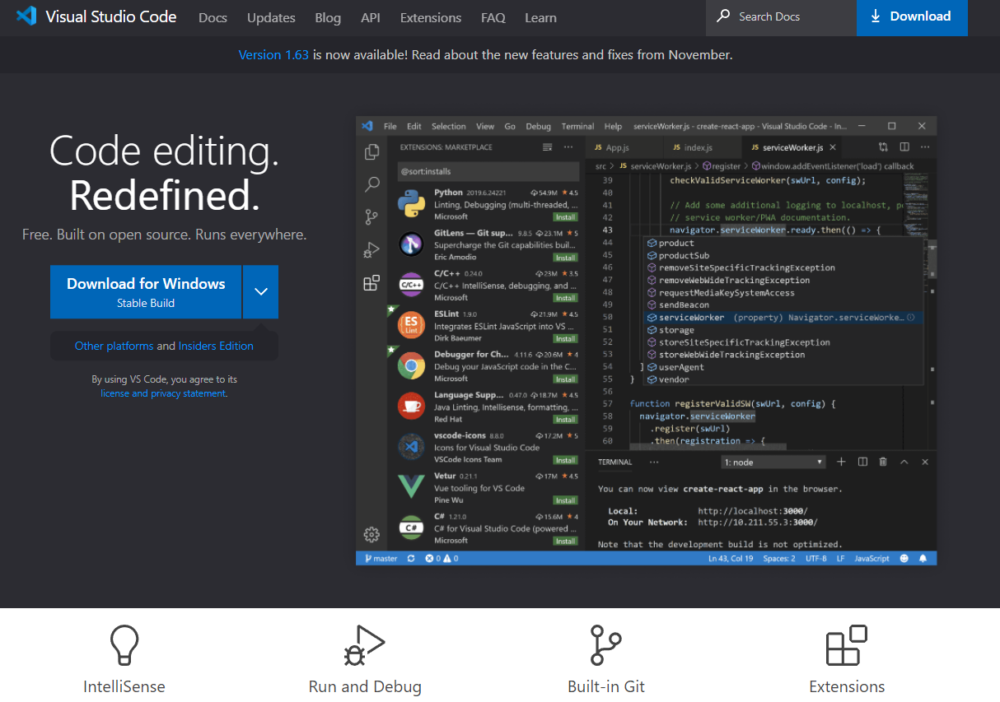
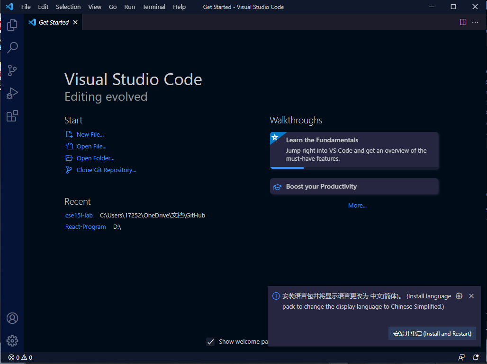
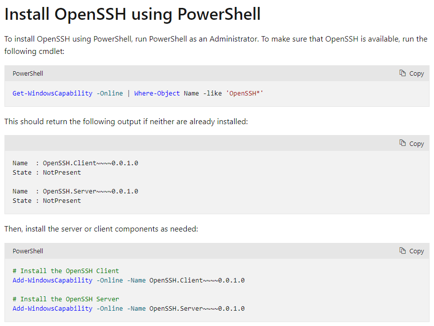
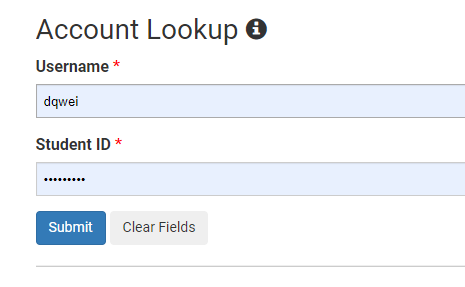

# **Lab Report 1**

> *This is an introduction of how to login the `"ieng6"` account.* 

**Table of Contents**

1. [Installing VScode](#first-step)
2. [Remotely Connecting](#second-step)
3. [Trying Some Commands](#third-step)
4. Moving Files with `scp`
5. Setting an SSH Key
6. Optimizing Remote Running

---

# **First Step**
> Installing Vscode.

* Go to the Visual Studio Code offical website using this [LINK]( https://code.visualstudio.com/).

* Click the blue button to install, and make sure to choose the right software for your operating system.

<p align="center">
  
</p>

* You should see a page same as this, that means you've done it correctly.

<p align="center">
  
</p>

---
# **Second Step**
> Settting up the SSH keys to login.

* If you are on Windows, extra step needed for [Install OpenSSh](https://docs.microsoft.com/en-us/windows-server/administration/openssh/openssh_install_firstuse) . Follow the step provided.

<p align="center">
  
</p>

* After that, or if you are not on Windows, look up your CSE15L account using the [Account Lookup](https://sdacs.ucsd.edu/~icc/index.php) website.

<p align="center">
  
</p>

* After Lookup, type in `ssh cs15lwi22and@ieng6.ucsd.edu`(with your account id) in the Vscode terminal, it will show up something like this. Type yes, and your password for first time login.


```
# code block

⤇ ssh cs15lwi22and@ieng6.ucsd.edu
The authenticity of host 'ieng6-202.ucsd.edu (128.54.70.227)' can't be established.
RSA key fingerprint is SHA256:ksruYwhnYH+sySHnHAtLUHngrPEyZTDl/1x99wUQcec.
Are you sure you want to continue connecting (yes/no/[fingerprint])? 
Password: 
Last login: Wed Jan  5 17:35:33 2022 from 071-083-152-013.res.spectrum.com
quota: No filesystem specified.
Hello cs15lwi22and, you are currently logged into ieng6-203.ucsd.edu

You are using 0% CPU on this system

Cluster Status
Hostname     Time    #Users  Load  Averages
ieng6-201   20:05:01   28  2.32,  2.78,  2.65
ieng6-202   20:05:01   19  2.05,  2.12,  2.16
ieng6-203   20:05:01   18  2.38,  2.31,  2.33

Thu Jan 13, 2022  8:07pm - Prepping cs15lwi22
```

# Third Step
