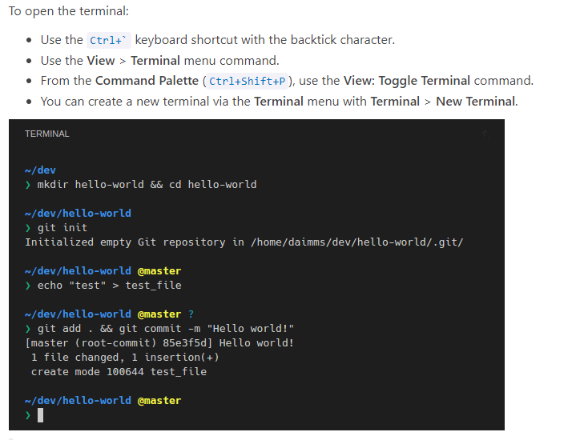

# **Lab Report 1**

> *This is an introduction of how to login the `"ieng6"` account.* 

**Table of Contents**

1. [Installing VScode](#first-step)
2. [Remotely Connecting](#second-step)
3. [Trying Some Commands](#third-step)
4. [Moving Files with `scp`](#fourth-step)
5. [Setting an SSH Key](#fifth-step)
6. [Optimizing Remote Running](#sixth-step)

---

# **First Step**
> Installing Vscode.

* Go to the Visual Studio Code offical website using this [LINK]( https://code.visualstudio.com/).

* Click the blue button to install, and make sure to choose the right software for your operating system.

<p align="center">
  
</p>

* You should see a page same as this, that means you've done it correctly.

<p align="center">
  
</p>

---
# **Second Step**
> Settting up the SSH keys to login.

* If you are on Windows, extra step needed for [Install OpenSSh](https://docs.microsoft.com/en-us/windows-server/administration/openssh/openssh_install_firstuse) . Follow the step provided.

<p align="center">
  
</p>

* After that, or if you are not on Windows, look up your CSE15L account using the [Account Lookup](https://sdacs.ucsd.edu/~icc/index.php) website.

<p align="center">
  
</p>

* After Lookup, type in `ssh cs15lwi22and@ieng6.ucsd.edu`(with your account id) in the Vscode terminal. Here is how you open terminal in VScode.
<p align="center">
  
</p>

* it will show up something like this. Type yes, and your password for first time login.


```
⤇ ssh cs15lwi22and@ieng6.ucsd.edu
The authenticity of host 'ieng6-202.ucsd.edu (128.54.70.227)' can't be established.
RSA key fingerprint is SHA256:ksruYwhnYH+sySHnHAtLUHngrPEyZTDl/1x99wUQcec.
Are you sure you want to continue connecting (yes/no/[fingerprint])? 
Password: 
Last login: Wed Jan  5 17:35:33 2022 from 071-083-152-013.res.spectrum.com
quota: No filesystem specified.
Hello cs15lwi22and, you are currently logged into ieng6-203.ucsd.edu

You are using 0% CPU on this system

Cluster Status
Hostname     Time    #Users  Load  Averages
ieng6-201   20:05:01   28  2.32,  2.78,  2.65
ieng6-202   20:05:01   19  2.05,  2.12,  2.16
ieng6-203   20:05:01   18  2.38,  2.31,  2.33

Thu Jan 13, 2022  8:07pm - Prepping cs15lwi22
```

# Third Step
> Here is some commands that you could try out. 
- `ls` , short for "list", listing all the files in the current directory
- `ls -a` , for listing all the files including the "dot files" in the current directory
- `ls <directory>` list all the file in directory provided
- `pwd` , showing the current working directory
- `cd` , short for "change directory", it can move you to another directory
- `touch <filename>`, for creating files, such as `touch file.txt`. 
- `exit`, exit the remote `ieng6` server.

## Examples of Using the command: 
```
[cs15lwi22and@ieng6-203]:~:56$ ls      # Listing Files
WhereAmI.class  WhereAmI.java  perl5
[cs15lwi22and@ieng6-203]:~:57$ ls -a   # Listing Files including the dot files
.   .bash_history  .bashrc  .config  .kshrc  .locallogin  .modulesbegenv  .procmailrc  .ssh       .zshenv  WhereAmI.class  perl5
..  .bash_profile  .cache   .cshrc   .local  .login       .motd           .profile     .zprofile  .zshrc   WhereAmI.java
[cs15lwi22and@ieng6-203]:~:58$ mkdir folder   # creating a new directory
[cs15lwi22and@ieng6-203]:~:59$ ls  
WhereAmI.class  WhereAmI.java  folder  perl5
[cs15lwi22and@ieng6-203]:~:60$ cd folder/   # changing directory to the new folder
[cs15lwi22and@ieng6-203]:folder:61$ pwd   # current directory
/home/linux/ieng6/cs15lwi22/cs15lwi22and/folder
[cs15lwi22and@ieng6-203]:folder:62$ touch words.txt # create files
[cs15lwi22and@ieng6-203]:folder:63$ ls
words.txt
[cs15lwi22and@ieng6-203]:folder:64$ exit # quit
logout
Connection to ieng6.ucsd.edu closed.
dylansmcbookpro:/ yujiwei$
```
# Fourth Step
> you may have some java files that you want to run on the `ieng6` server, copy that file into the remote server using `scp` command.

* Format: `scp <filename> <accountid>:~/`

## Examples of copying file:

If we want to copy a file named `test.java` and has following content:
```
class test{
        public static void main(String[] args){
                System.out.println(System.getProperty("os.name"));
                System.out.println(System.getProperty("user.name"));
                System.out.println(System.getProperty("user.home"));
                System.out.println(System.getProperty("user.dir"));
        }
}
```
Then, in your local terminal, do the scp command line.
```
dylansmcbookpro:Desktop yujiwei$ ls #on local server
CSE12
CSE15L
CSE20
Folder
Math 20B
test.java
dylansmcbookpro:Desktop yujiwei$ scp test.java cs15lwi22and@ieng6.ucsd.edu:~/
test.java                                            100%  195     5.7KB/s   00:00
dylansmcbookpro:Desktop yujiwei$
```

## Compile and run on the remote server
```
[cs15lwi22and@ieng6-203]:~:79$ ls # This is on the remote sever, I'm already logged in.
WhereAmI.class  WhereAmI.java  folder  perl5  test.java
[cs15lwi22and@ieng6-203]:~:80$ javac test.java
[cs15lwi22and@ieng6-203]:~:81$ java test
Linux
cs15lwi22and
/home/linux/ieng6/cs15lwi22/cs15lwi22and
/home/linux/ieng6/cs15lwi22/cs15lwi22and
[cs15lwi22and@ieng6-203]:~:82$
```

# Fifth Step
> Every time you login it requires you to type in the password, if we set up a SSH key, it won't ask you for password and it will save you a lot of time.


# Sixth Step
