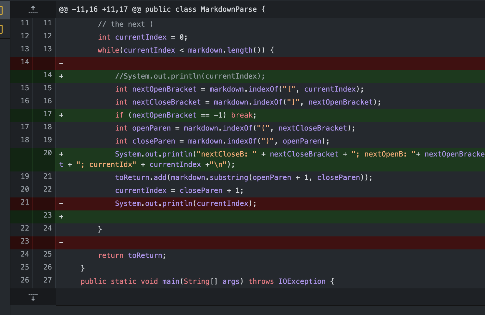
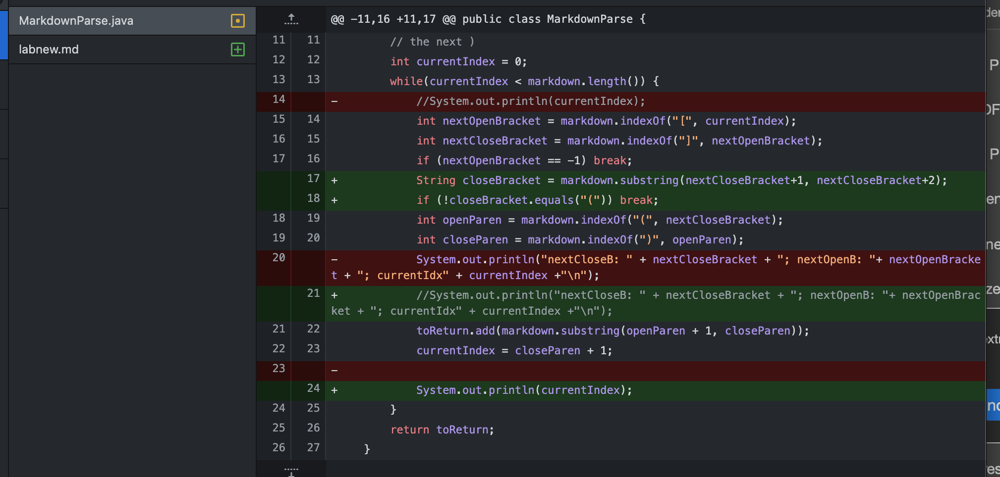
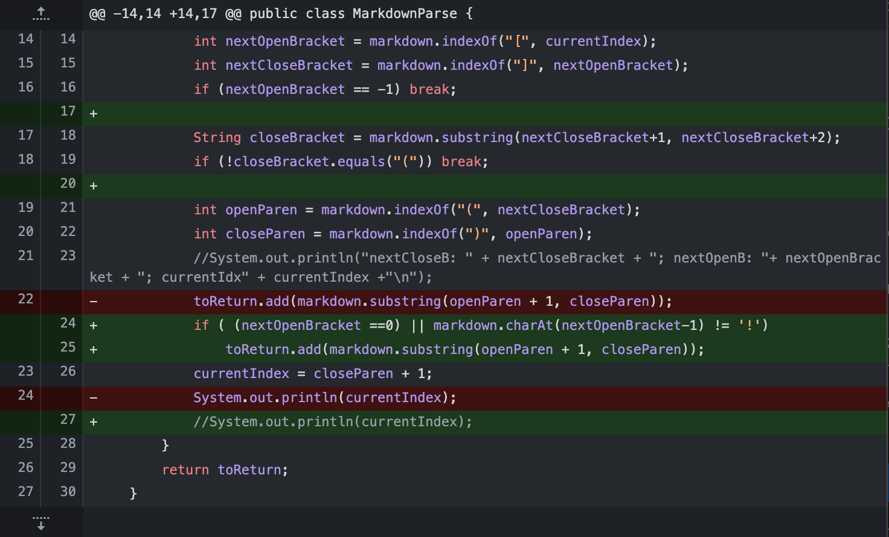

# **Lab Report 2**

> This is demonstration of how to fix bugs systematically. In Lab3 and Lab4 we worked on a file called MarkdownParse.java. Its purpose is to find all the link in a Markdown file, but the code will occur problems when testing different files, and it requires some changes.

# **First Code Change**
1. Screenshot of the first code changez

  

2. [Link to failure-inducing input file](test-file/test-file.md)

3. Symptom of the failure-inducing input
- The symptom is that there will be an infinite loop because the mthods indexOf() cannot find the next opening parenthesis because it is before a closing bracket. Therefore the currentIndex will be set to -1, and the while loop execute forever.

4. Explanation
- Therefore, our first solution is fairly simple, make the program break when encounter a problem that the parenthesis is inside the square brackets shown in line 17. When we cannot find the next open bracket. By this way the loop can be stop and it will return an empty list. It makes the codes executable, but it is still not the desire output that we want.

# **Second Code Change**

1. Screenshot of the first code change

  

2. [Link to failure-inducing input file](test-file/test-file.md)

3. Symptom of the failure-inducing input:

4. Explanation

# **Third Code Change**

1. Screenshot of the first code change

  

2. [Link to failure-inducing input file](test-file/test-file2.md)

3. Symptom of the failure-inducing input

4. Explanation
