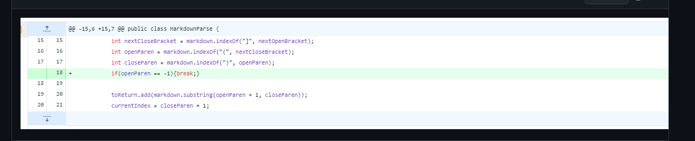

# **Lab Report 2**

> This is demonstration of how to fix bugs systematically. In Lab3 and Lab4 we worked on a file called MarkdownParse.java. Its purpose is to find all the link in a Markdown file, but the code will occur problems when testing different files, and it requires some changes.


# **First Code Change**
1. Screenshot of the first code change
<p align="center">
  
</p>

2. [Link to failure-inducing input file](test-file/test-file.md)

3. Symptom of the failure-inducing input
- The error message is: 
```
Dylans-Mac-Book-Pro:week2 yujiwei$ javac MarkdownParse.java 
Dylans-Mac-Book-Pro:week2 yujiwei$ java MarkdownParse test-file.md 
Exception in thread "main" java.lang.StringIndexOutOfBoundsException: begin 0, end -1, length 2
        at java.base/java.lang.String.checkBoundsBeginEnd(String.java:4601)
        at java.base/java.lang.String.substring(String.java:2704)
        at MarkdownParse.getLinks(MarkdownParse.java:22)
        at MarkdownParse.main(MarkdownParse.java:31)

```

4. Explanation
- The symptom is that it will throw an Index Out Of Bounds Exception because the Substring() methods cannot find index at -1. The index is -1 because in the inducing input it is only an empty brackets and there is no link at all to look for. It will utimately result in a crash of the program which causes a bug that the program cannot run correctly. Our first solution is fairly simple, make the program break when encounter a problem that the while loop will stop when we cannot find open parenthesis shown in line 18. By this way the loop can be stop and it will return an empty list. It makes the codes executable, but still not all the problems are being solved.

# **Second Code Change**

1. Screenshot of the first code change
<p align="center">
  
</p>

2. [Link to failure-inducing input file](test-file/test-file2.md)

3. Symptom of the failure-inducing input:
- The error message is:
```
Dylans-Mac-Book-Pro:week2 yujiwei$ javac MarkdownParse.java 
Dylans-Mac-Book-Pro:week2 yujiwei$ java MarkdownParse test-file2.md 
^C Dylans-Mac-Book-Pro:week2 yujiwei$  ##I'm using control + c to terminate the program.
```


4.Explanation
This symptom of this test file is that we will have an infinite loop because the next close parenthesis cannot be found. Therfore, the current index in line 27 will always -1 + 1, and making the currentIndex always smaller than the markdown.length(). This is because the inducing input of [()], where the program cannot found the next closing parenthesis before the the closing brackets. Our second solution is also an easy fix, make the program break when we encouter a problem like this where no links are provided. This way we can we can easily jump out of the loop and return the empty list.


# **Third Code Change**

1. Screenshot of the first code change
<p align="center">
  
</p>


2. [Link to failure-inducing input file](test-file/test-file3.md)

3. Symptom of the failure-inducing input:
- This is not what we expected:
```
Dylans-Mac-Book-Pro:week2 yujiwei$ javac MarkdownParse.java 
Dylans-Mac-Book-Pro:week2 yujiwei$ java MarkdownParse test-file3.md 
[]
```

4. Explanation
The symptom of this time is producing the wrong answer. The inducing input that causes this to occur is becasue for the last two test files we didn't add actual links into the markdown file. Therefore in test-file3 we added the link, and We expected test-file3 to have two links but it is not being added to the list. At the end, our group solution is to add line 22-25. To move on to the next character and find the next links.
