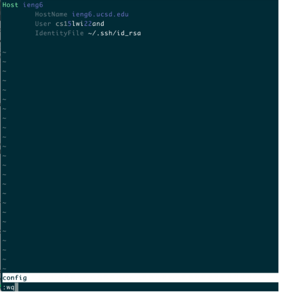

# **Lab Report 3**

**Choice : Streamlining ```ssh``` configuration. The reason to setup a configuration file is to save you time when logging into the remote server. Instead of typing: ```sssh cs15lwizzz@ieng6.ucsd.edu```, we can easily type in ```sssh ieng6 ``` to login into  your account on your own computer.** 

# **Step 1: Showing .ssh/config file, and how I edited it**
In your local computer, find the ```.ssh``` directory and add a file name ```config```. In the ```config``` file, type in the following: (Here shows a full capture of what I did.)

```
Dylans-Mac-Book-Pro:.ssh yujiwei$ cd ~ #change directory to home
Dylans-Mac-Book-Pro:~ yujiwei$ ls -a #list all the files, and includes dot files.

.IdentityService	.designer		.matplotlib		.vim			Projects
.ShadowsocksX-NG	.gitconfig		.mono			.viminfo		Public
.Trash			.gnupg			.npm			.vscode			PycharmProjects
.anaconda		.gnupg_pre_2.1		.nvimrc			Applications		get-pip.py
.android		.idlerc			.oracle_jre_usage	Apps			my_program
.bash_history		.ipynb_checkpoints	.pylint.d		Desktop			node_modules
.bash_profile		.ipython		.python_history		Documents		package-lock.json
.bash_profile.pysave	.jupyter		.redhat			Downloads
Dylans-Mac-Book-Pro:~ yujiwei$ cd .ssh #change to .ssh directory
Dylans-Mac-Book-Pro:.ssh yujiwei$ nvim config #use nvim to create a config file.
Dylans-Mac-Book-Pro:.ssh yujiwei$ ls
config		id_rsa		id_rsa.pub	known_hosts
```


# **Step 2: Showing .ssh/config file, and how I edited it**

So, I use nvim to directly edit file in the terminal. First, enter the insert mode using ``` i ```, and type in the following:
(Screenshot of Using vim):
<p align="center">
  
</p>


>  To Explain:
```
Host ieng6   // Host of the server
	HostName ieng6.cusd.edu //Host name
	User cs15lwi22and // my user id
	IdentityFile ~/.ssh/id_rsa //my credentials(passwords)
```
By quitting the insert mode and typing ```:wq```, to save the ```config``` file in the ```.ssh``` directory.


# **Result 1: Showing the ```ssh``` command logging you into my account**
Now we can login only using ```ssh ieng6```
<p align="center">
  
</p>


# **Result 2: Show an ```scp``` command copying a file to my account using the alias**
We can use ```ieng6``` alias to copy files.
```
Dylans-Mac-Book-Pro:Desktop yujiwei$ ls
CSE12					Math 20B				markdown-parse
CSE15L					Screen Shot 2022-02-10 at 14.55.22.png	test-copy
CSE20					Screen Shot 2022-02-10 at 15.05.23.png	webregMain.pdf
Folder					Screen Shot 2022-02-10 at 15.05.45.png
Formulas.pdf				Slay the Spire.app
Dylans-Mac-Book-Pro:Desktop yujiwei$ scp markdown-parse/test-file2.md ieng6:~/ 
# I want to copy the test-file2.md into the home directory of the remote server.

test-file2.md                                    100%  110    19.5KB/s   00:00

Dylans-Mac-Book-Pro:Desktop yujiwei$ ssh ieng6 #Logging in
Last login: Thu Feb 10 15:05:17 2022 from 128.54.199.13
quota: No filesystem specified.
Hello cs15lwi22and, you are currently logged into ieng6-202.ucsd.edu

You are using 0% CPU on this system

Cluster Status
Hostname     Time    #Users  Load  Averages
ieng6-201   15:15:01   41  1.24,  1.87,  2.43
ieng6-202   15:15:01   35  1.37,  1.04,  1.12
ieng6-203   15:15:01   41  1.67,  1.76,  2.17


Thu Feb 10, 2022  3:17pm - Prepping cs15lwi22
[cs15lwi22and@ieng6-202]:~:229$ ls
WhereAmI.class  folder                markdown-parse-lab3  skill-demo     test.class
WhereAmI.java   grade-markdown-parse  perl5              test-file2.md  test.java
[cs15lwi22and@ieng6-202]:~:230$ #The test-file2.md succesfully copied.
```

