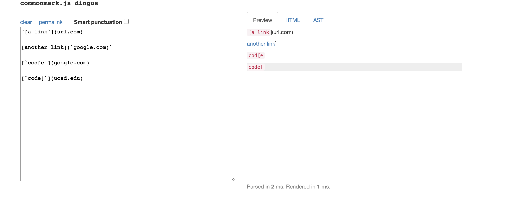
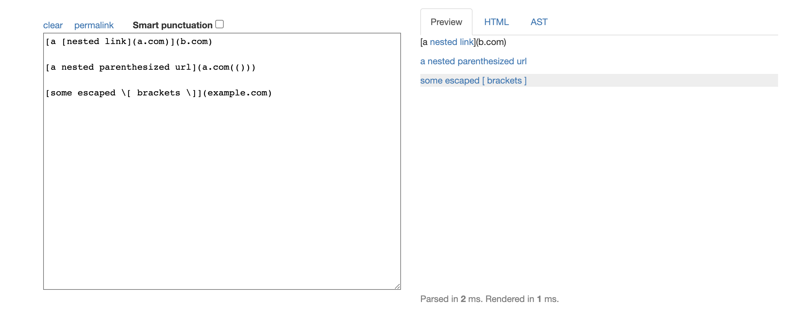
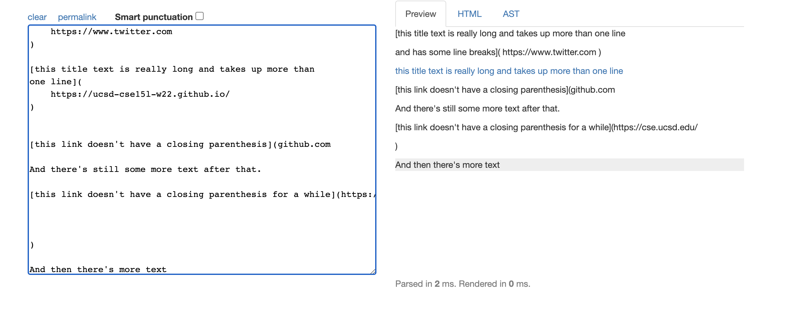
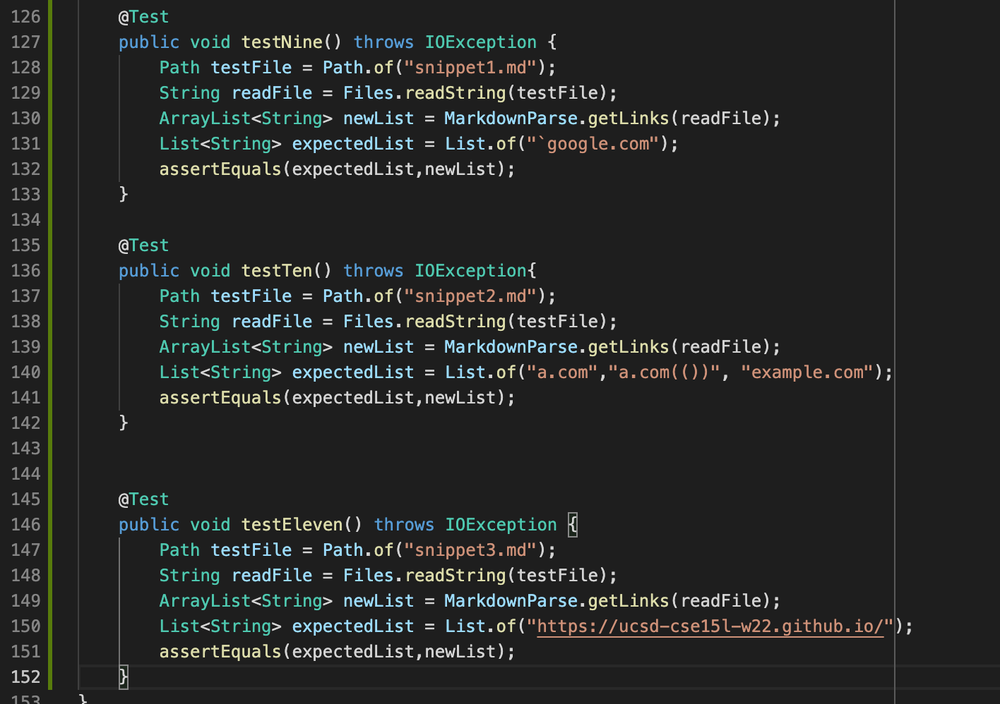
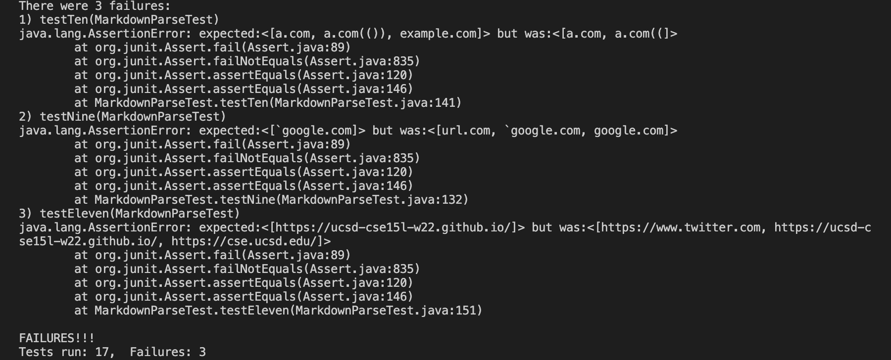
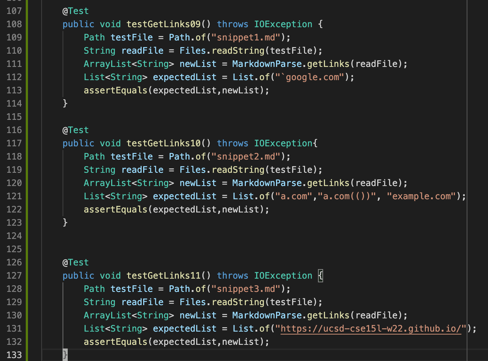
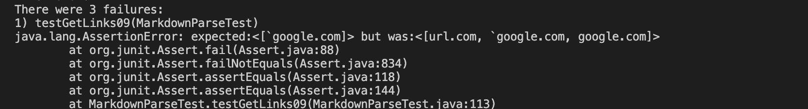
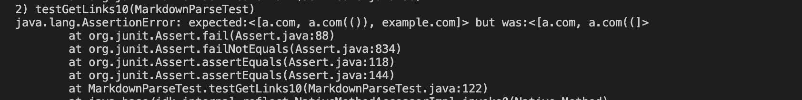
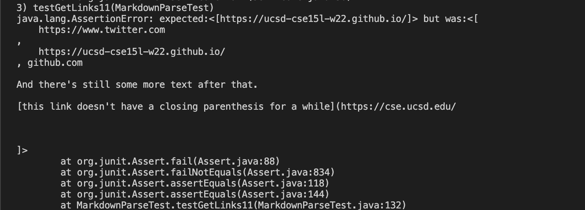

# **Lab Report 3**


[Link to our repository](https://github.com/KQwQK/markdown-parse-lab3)

[Link to the repository we reviewed](https://github.com/vs2961/markdown-parse)


# Decide on the Link using [CommonMark demo site](https://spec.commonmark.org/dingus/)

Result for Snippet 1:
<p align="center">
  
</p>
- Therefore, for snippet 1 only `google.com should be a valid link.

Result for Snippet 2:
<p align="center">
  
</p>

- Therefore, for snippet 2 a.com, a.com(()), and example.com should be the valid links.

Result for Snippet 3:
<p align="center">
  
</p>

- Therefore, for snippet 3 only hettp://ucsd-cse15l-w22.github.io/ is a valid Link.


**Using the command ```make test``` that is written in the makefile, I get the following result.**

# Tests Implmententation for Other group
<p align="center">
  
</p>

# Tests Result in Junit for Other group
<p align="center">
  
</p>


# Tests Implmentation for My group
<p align="center">
  
</p>

# Tests Result in Junit for My group
Test 1
<p align="center">
  
</p>

Test 2
<p align="center">
  
</p>

Test 3
<p align="center">
  
</p>

# Conclusion & Reflection

1. Reflecting on Snippet 1 and is there an easy fix:

In my perspective, I think the snippet 1 can have small code fix because all we need to do is to check the character that is before the open brackets. If there is anything before the open brackets then it is not a valid links(like in snippet 1 it is a backticks.) On the other hand, if in a pair of brackets, if there are any other pair of things that make the text not a link then break the loop. For example, the two backticks ```'cod[e'``` that is in link 2 and 3. These two changes can be smaller than 10 lines.


2. Reflecting on Snippet 2 and is there an easy fix: 

In my perspective, I think snippet 2 does not have an easy fix that is 10 lines smaller. If I were to solve the question, I think we need to define a recursive functions that will search for every brackets that is inside a brackets. Further, for each inside brackets, we need to check edge cases like in snippet1 the backticks, escaped brackets, exclamation mark and so on. Also, for links that include a parenthesis is also edge cases that is very hard to eliminate. We need to check if it follows a opening brackets to make sure is not a link, and we will need find the last closing parenthesis to make sure the a.com(()) is a link it self. Therefore, I think I will need to write one or more methods to fix the problems that is not an easy fix.


3. Reflecting on Snippet 3 and is there an easy fix: 

In my perspective, I think snipper 1 can have small code fix for two things. First, use ```.trim()``` methods on string of the links to make sure there is space to eliminate newlines inside brackets. Second, we will have an if statements to check if there is an closing parenthesis before the opening brackets of the next links. If there is not, meaning that the link doesn't have a closing parenthesis and it is not a link, then we move on to the next open brackets to check other links. Thus, it eliminates all the edge cases in snippet 3.
